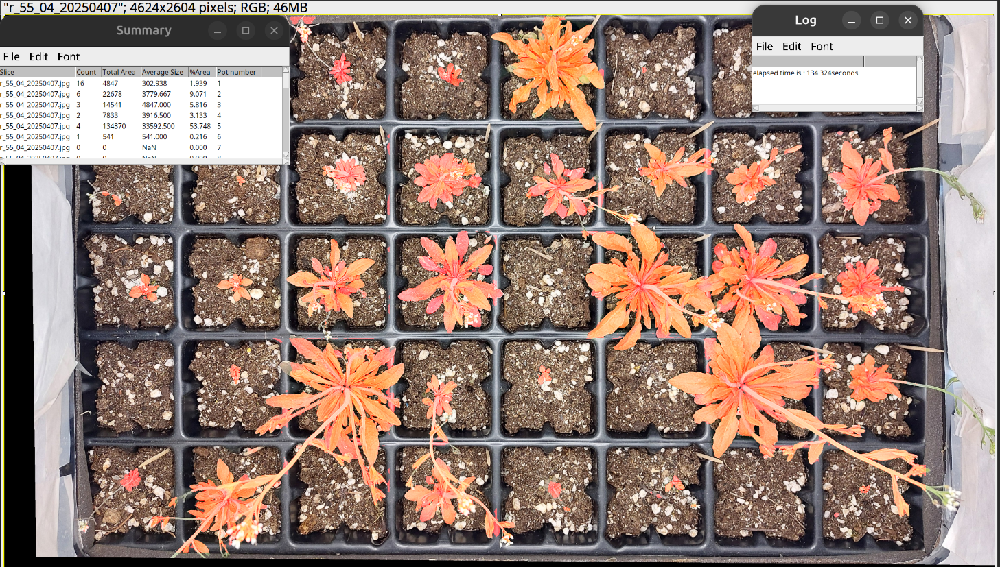
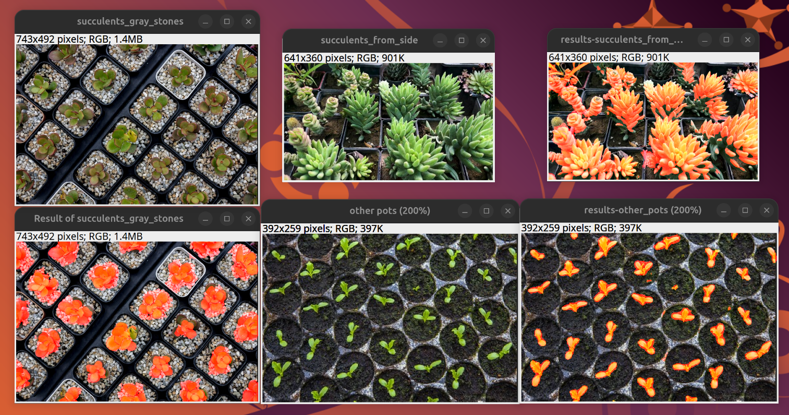

# arabido-J
The objective of this repository is to provide solutions for the analysis of (Arabidopsis) plant trays with ImageJ/FIJI. We provide several tools: one for plant trays registration (semi-automatic), and two for plant segmentation (one using Ilastik, one using a custom deep learning model). Below is an example of a result using the deeplearning solution, where the plants are highlighted in red. The screenshot also shows the log window displaying the computational time for a single tray (2 minutes on CPU) and the "Summary" window for the results. 

See the .pdf file in the repository for detailed documentation and guidelines.

## version 2 (Nov 25)
Updates: added the deeplearning version of the IJ macro (segmentation_analyze_pots_deeplearning.ijm). It uses DeepImageJ and a custom residualUnet deeplearning network created using BiaPy. 

It does not require anymore a specific training with Ilastik. It has been trained on 4 experimental data sites (100 images (pots) in the training set) so it might not be perfect! Help with traing data generation would be appreciated to make it better!

It does require DeepImageJ as ImageJ plugin. It will run on CPU except if you manage to follow the exact GPU guidelines for DeepImageJ (github.com/deepimagej/deepimagej-plugin/wiki/GPU-connection).

I also added the pot_cropping.ijm macro to crop the plant trays pot by pot in order to generate raw training data for the segmentation model.

### Does it generalizes well?
The model has only been trained on pots of Arabidopsis trays seen from above, with black pots. Here below I tested it on some plant trays pictures (without any croping at the pot scale) found on the web. It does work quite well, although with some errors, showing that it could be fine-tuned for your case. The BMZ model can be reimported into BiaPy so you can fine-tune it on your own data with no coding required.

## version 1
Two tools to study plant trays. An example image below:

A first tool allows image registration. A second tool performs plant segmentation (through an Ilastik model that must have been trained previously) and computes plant area per plant pot (see result below). More informations can be found in the pdf file in the repository.

Registration_trays.ijm : imageJ macro for semi-automatic registration of plant trays.

segmentation_analyze_pots.ijm : imageJ macro for plant segmentation and pot by pot analysis. Requires the Ilastik software (https://www.ilastik.org/) and the ilastik & MorpholibJ ImageJ plugins (add update sites: ilastik, IJPB-plugins).

arabido_analysis.py: Python code to analyse the results of the .csv file (output from the segmentation macro). Requires the Matplotlib and Pandas librairies.

