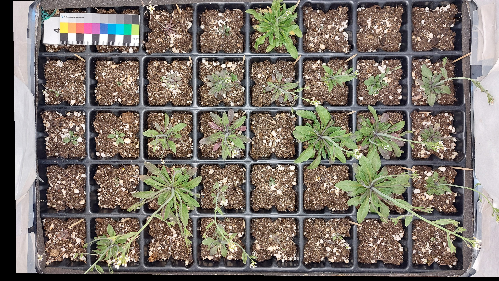

# arabido-J

Two tools to study plant trays. An example image below:

A first tool allows image registration. A second tool performs plant segmentation (through an Ilastik model that must have been trained previously) and computes plant area per plant pot. More informations can be found in the pdf file in the repository.
