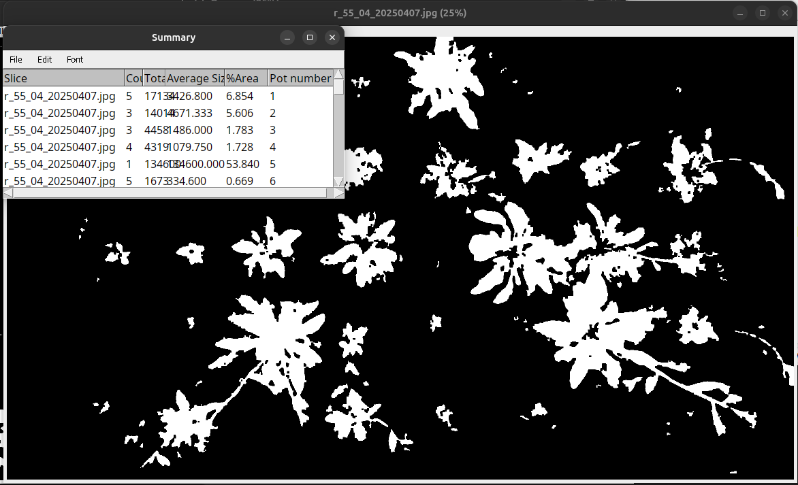

# arabido-J
See the .pdf file in the repository for detailed documentation and guidelines.
## version 2 (Nov 25)
Updates: added the deeplearning version of the IJ macro (segmentation_analyze_pots.ijm). It uses DeepImageJ and a custom residualUnet deeplearning network created using BiaPy. 

It does not require anymore a specific training with Ilastik. It has been trained on 4 experimental data sites (80 images in the training set, 20 per sites) so it might not be perfect! Help with traing data generation would be appreciated to make it better!

It does require DeepImageJ as ImageJ plugin. it will run on CPU except if you manage to follow the exact GPU guidelines for DeepImageJ (github.com/deepimagej/deepimagej-plugin/wiki/GPU-connection).

## version 1
Two tools to study plant trays. An example image below:

A first tool allows image registration. A second tool performs plant segmentation (through an Ilastik model that must have been trained previously) and computes plant area per plant pot (see result below). More informations can be found in the pdf file in the repository.

Registration_trays.ijm : imageJ macro for semi-automatic registration of plant trays.

segmentation_analyze_pots.ijm : imageJ macro for plant segmentation and pot by pot analysis. Requires the Ilastik software (https://www.ilastik.org/) and the ilastik & MorpholibJ ImageJ plugins (add update sites: ilastik, IJPB-plugins).

arabido_analysis.py: Python code to analyse the results of the .csv file (output from the segmentation macro). Requires the Matplotlib and Pandas librairies.

